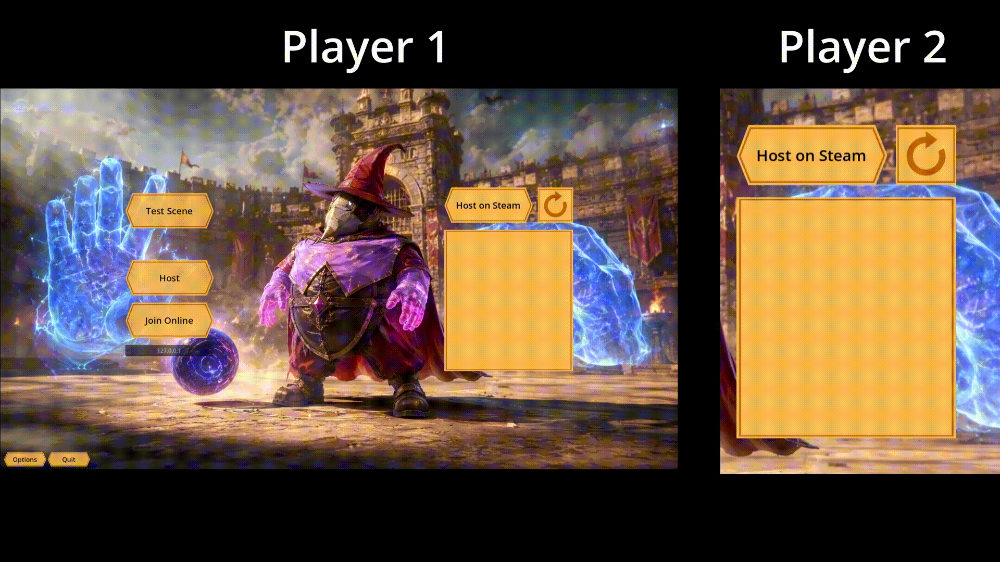

# Multiplayer Project

Welcome to **Magic Balls**, a project I created to experiment with Godot Engine's multiplayer functionalities.

This project includes a singleplayer test scene for experimentation and a multiplayer lobby system that works both with local LAN connection and via the Steam API!

Controls for the game are as following:

- **WASD**: Move Around
- **Space Bar**: Jump. Is affected by the direction you are looking at!
- **Mouse Movement**: Change Camera Direction
- **Left Mouse Button**: Activate your grabby hand, that can hold the ball
- **Right Mouse Button**: Activate your punchy hand, which can push the ball, players or even yourself if you aim at the ground or walls

# Functionality

## Steam Connection

Steam connection needs you to have Steam open (obviously) and sadly is unable to connect multiple users with the same account, so if you want to test it out you will require multiple machines with different Steam accounts logged in.

Besides the functionality to search for open lobbies that are displayed in the lobby list and connect with other players with no need for port-forwarding, it works exactly the same as the local connection!

## Lobby

The lobby allows for users to specify if they are ready for the match and change teams. When joining, players are automatically added to the team with less players!

## Gameplay

The game itself is bootleg Rocket League with a magic theme and clunky controls. I will admit I did not put much effort in the gameplay itself, so holding the ball sometimes block you when you jump and this kind of stuff.

The most fun part is charging your Punchy Hand (Right Mouse Button) and punching the ground, propelling you like a missile through the air!

The existing arena comports the spawning of 4 players on each team. If you manage to get more than 8 people to play on this pet project, armed forces WILL be sent to your house and eliminate you.

There is also an easter egg if you manage to score 7 to 1, which is only possible in multiplayer.

# Have fun!
